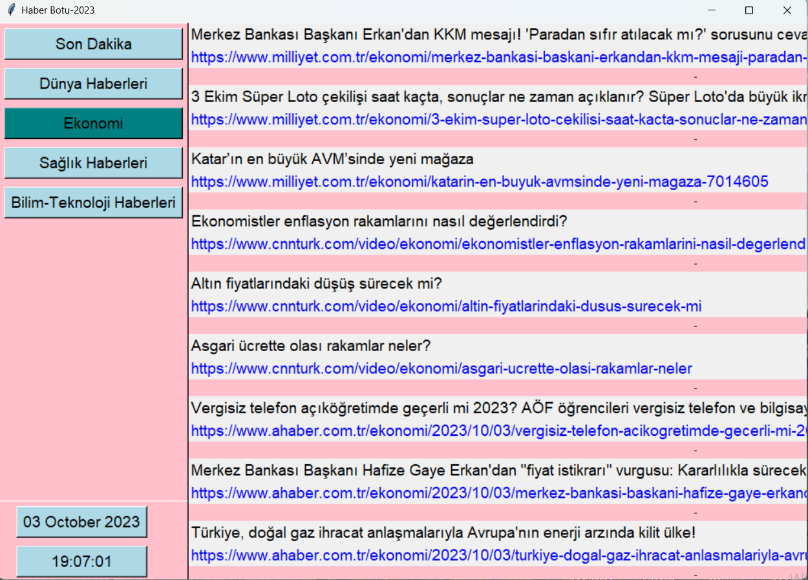

# Haber Botu - 2023

Haber Botu, haberleri çeşitli kategorilerde ve kaynaklardan getiren bir Python uygulamasıdır. Bu uygulama ile güncel haberlere kolayca erişebilirsiniz.

## Özellikler

- Son dakika haberlerine erişim
- Dünya haberlerine göz atma
- Ekonomi, sağlık ve bilim-teknoloji haberlerini okuma
- Haber başlıklarına tıklama ile detaylı haberlere ulaşma

## Ekran Görüntüsü



## Kullanım

1. Uygulamayı çalıştırın.
2. Menüden ilgi alanınıza uygun bir kategori seçin.
3. Haber başlıklarını ve detaylarını görüntüleyin.

## Bağımlılıklar

Bu uygulama aşağıdaki Python kütüphanelerine ihtiyaç duyar:

- `feedparser` (Haber kaynaklarından haberleri almak için)
- `tkinter` (Grafik arayüz oluşturmak için)
- `webview` (Web sayfalarını görüntülemek için)
- `datetime` (Zaman ve tarih bilgilerini işlemek için)

Gerekli bağımlılıkları kurmak için aşağıdaki komutları kullanabilirsiniz:

```bash
pip install feedparser
pip install tk
pip install pywebview

